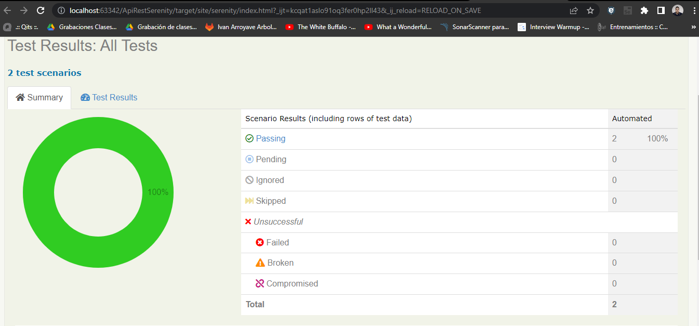

# Pruebas de Herramientas de automatización Serenity VS Karate(Services Rest)

El objetivo de este taller es realizar pruebas automatizadas de servicios Rest empleando BDD, proporcionando un acercamiento a las herramientas disponibles, y así conocer las características o pasos necesarios para implementarlas.

**Nota:** En este repositorio encontrará una guía para la automatización, tenga en cuenta los archivos
build.gradle para su elaboración, se recomienda el IDE Intellij , y una versión Java superior a 8. Use buenas prácticas de programación.

## Requisitos generales de la automatización:

- Seleccione cuatro servicios Rest de la pagina [https://reqres.in/](https://reqres.in/) (sugerencia un CRUD)
- Automatice 2 de los servicios empleando el framework de Serenity BDD.
- Automatice 2 de los servicios empleando el framework de Karate.
- Genere los reportes de la ejecución de cada framework.

### Serenity BDD

1. Explore previamente la aplicación que pretende automatizar en Postman (Respuestas esperadas).
2.  Defina claramente la característica que desea automatizar.
3.  Emplee el uso del patrón ScreenPlay (tasks, Questions, stepdefinitions, runners, features, etc).
4.  Genere un reporte con las evidencias de la ejecución.

Ejemplo del reporte:

- **Recursos sugeridos:**

[https://serenity-bdd.github.io/docs/screenplay/screenplay_rest](https://serenity-bdd.github.io/docs/screenplay/screenplay_rest)

[https://github.com/serenity-bdd](https://github.com/serenity-bdd)

[https://www.youtube.com/watch?v=v6o0z2qrxLk&list=PLeo6Q1inqlOeti5rRcCvKbB_WDymxcAXO](https://www.youtube.com/watch?v=v6o0z2qrxLk&list=PLeo6Q1inqlOeti5rRcCvKbB_WDymxcAXO)

### Karate

1. Explore previamente la aplicación que pretende automatizar en Postman (Respuestas esperadas).
2. Defina claramente la característica que desea automatizar.
3. Genere un reporte con las evidencias de la ejecución.

Ejemplo del reporte:

- **Recurso sugerido:**

[https://github.com/karatelabs/karate](https://github.com/karatelabs/karate)

## En un repositorio entregar:

1. La solución del taller (automatización).
2. archivo de texto con las pruebas realizadas en Postman.
3. Capturas de pantalla de los reportes Generados.
4. Conclusiones del taller.

Bonus james

Plugin requeridos en intellij:
- Gherkin
- Cucumber for Java
